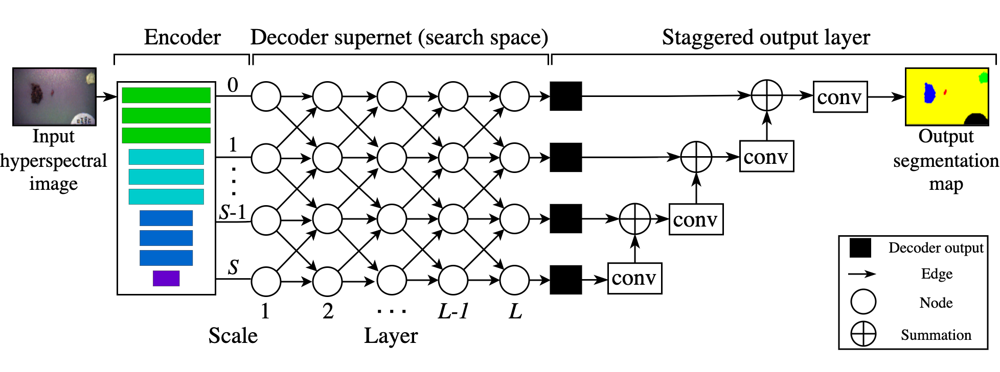

# AdaptorNAS
This repository is the offical implementation of _AdaptorNAS: A New Perturbation-based Neural Architecture Search for Hyperspectral Image Segmentation_.

An overview of AdaptorNAS:



## Getting started
- Download or clone this repo to your computer.
- Run `pip install -r requirements.txt` to install the required Python packages.
- The code was developed and tested on Python 3.6.13 and Ubuntu 16.04.
- Note that this codebase runs on [PyTorch Lightning library](https://www.pytorchlightning.ai).

## Preparing the UOW-HSI dataset
1. Download the data from https://documents.uow.edu.au/~phung/UOW-HSI.html.
2. Unzip the downloaded data into a desired location on your computer.
3. Copy the `./datasets/partition` folder from this repo into the same location.
   This folder contains the image ids for each cross-validation fold.

## Searching for the optimal decoder

The Python script for searching is the `main_search.py`. The script will search
for the optimal decoder, then train the derived network from scratch. 

Note that the script will also produce a `derived_model.ckpt` file after the search. This file contains the derived model architecture. 

Run `python main_search.py --help` for the full list of available arguments. 

### ResNet-34 encoder
An example of designing the optimal decoder for the ResNet-34 encoder with L=2, p=2, n=5.

```
python main_search.py --dataset_dir="path_to_the_data" --name="experiment_description" --nas_encoder="resnet34" --nas_layers=2 --nas_max_edges=2 --nas_selection_epochs=5 --batch_size=8 --gpu=1 --fold=1
```
### MobileNet-V2 encoder
An example of designing the optimal decoder for the MobileNet-V2 encoder with L=2, p=2, n=5. 

```
python main_search.py --dataset_dir="path_to_the_data" --name="experiment_description" --nas_encoder="mobilenet_v2" --nas_layers=2 --nas_max_edges=2 --nas_selection_epochs=5 --batch_size=11 --gpu=1 --fold=1 
```

### EfficientNet-B2 encoder
An example of designing the optimal decoder for the EfficientNet-B2 encoder with L=3, p=2, n=5.
```
python main_search.py --dataset_dir="path_to_the_data" --name="experiment_description" --nas_encoder="efficientnet-b2" --nas_layers=3 --nas_max_edges=2 --nas_selection_epochs=5 --batch_size=8 --gpu=1 --fold=1
```
